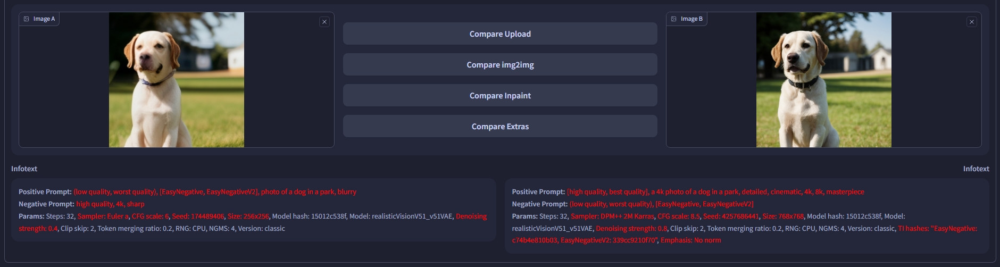

# SD Webui Image Comparison
This is an Extension for the [Automatic1111 Webui](https://github.com/AUTOMATIC1111/stable-diffusion-webui), which adds a new tab for image comparison.

 
<i>Draggable Image Slider</i>

Wanna check how your **img2img** went? Simply compare the results in the brand new **Comparison** tab!

<ins><b>Ways to Load the Images</b></ins>

1. Upload the input and output images manually
2. Click a button in the `Comparison` tab to load the images from `img2img` / `Extras` tab
3. Click a button in the `img2img` / `Extras` tab to send the images to `Comparison` tab
    - Enable this in the `User interface` section of **Settings**

<ins><b>Ways to Compare the Details</b></ins>

- Press `+` to zoom in; press `-` to zoom out
- Use `arrow keys` to move around
- Press `0` to reset the scale and position

Also comes with an **Infotext** panel below to quickly compare the generation parameters.
*(Only for manually uploaded images)*

 

