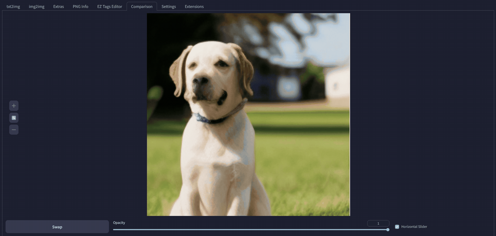

# SD Webui Image Comparison
This is an Extension for the [Automatic1111 Webui](https://github.com/AUTOMATIC1111/stable-diffusion-webui), which adds a new tab for image comparison.

 
<i>Draggable Image Slider</i>

Wanna check how your `img2img` went? 
Upload the input and output images manually, 
or click a button to load the images from **img2img** or **Extras** tab automatically,
to the new **Comparison** tab to compare the results!
This even works for cropped images!

 
There are probably existing packages for this purpose. 
But writing one myself is a good practice, and gives a sense of achievement :p 

