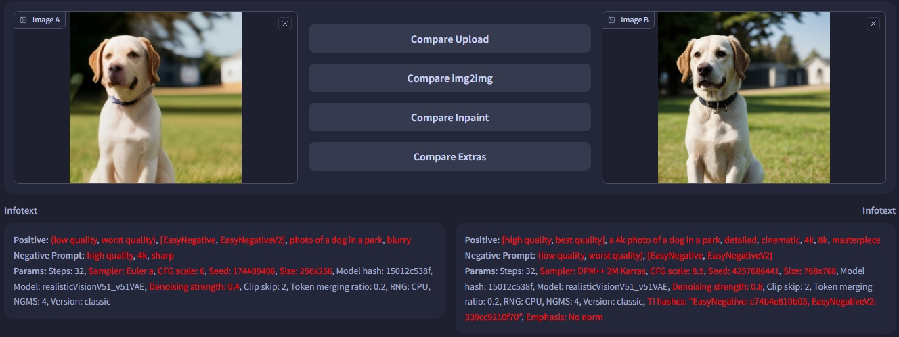

# SD Webui Image Comparison
This is an Extension for the [Automatic1111 Webui](https://github.com/AUTOMATIC1111/stable-diffusion-webui), which adds a new tab for image comparison.

 
<i>Draggable Image Slider</i>

Wanna check how your **img2img** went? 
Simply upload the input and output images manually, 
or click a button to load the images from `img2img` / `Extras` tab automatically,
to compare the results in the brand new **Comparison** tab!

Now also comes with an **Infotext** panel to compare the generation parameters.
*(Only for manually uploaded images)*

 

